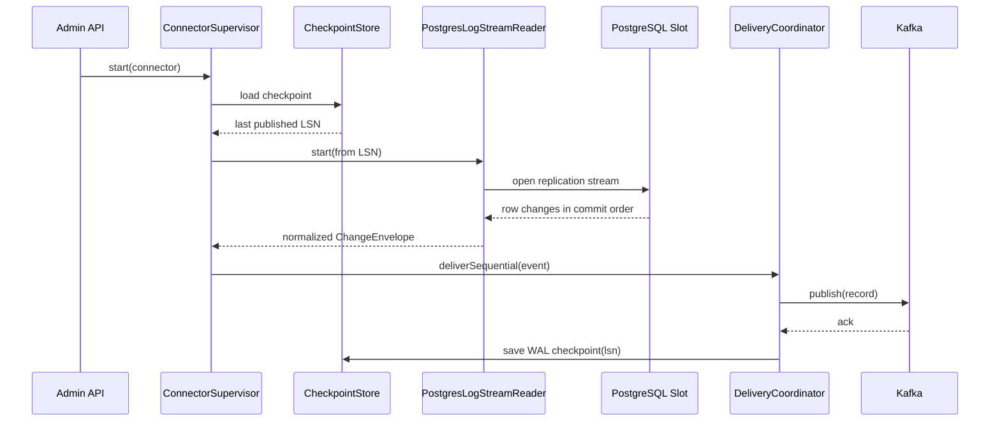
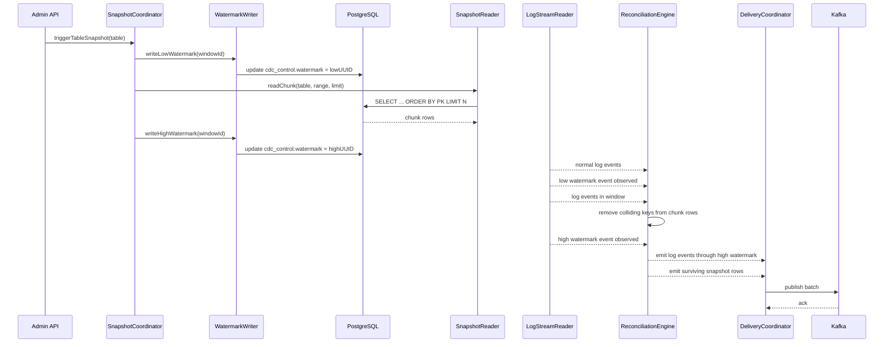
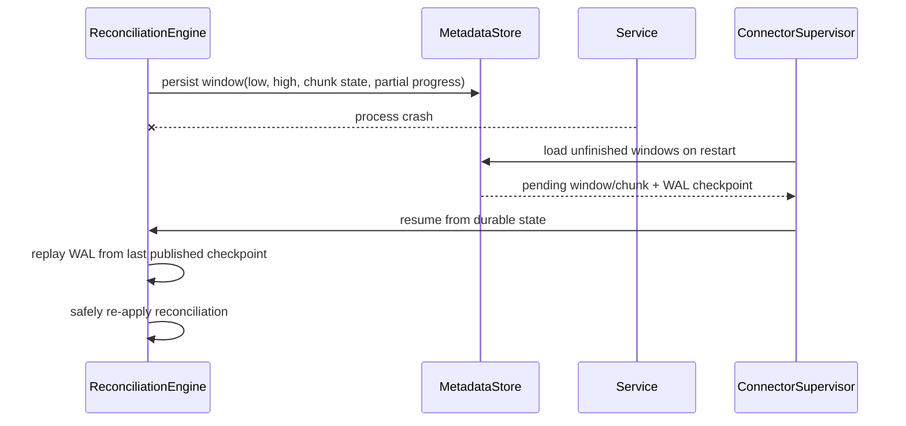
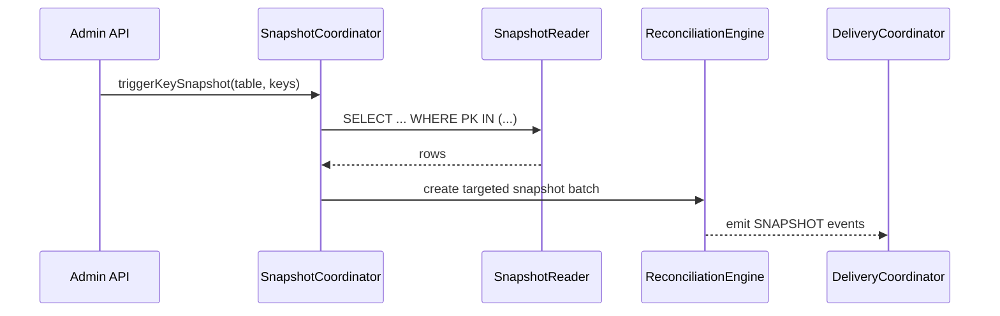

Absolutely. Since you’re targeting **PostgreSQL first**, the best version of this system is not “generic CDC with Postgres support.” It is a **PostgreSQL-first CDC engine with a narrow generic core**. That keeps the hard parts honest: logical decoding, slot management, watermark reconciliation, non-stale reads, and restart safety. DBLog’s public description is clear that the important behavior is interleaving log events with chunked table reads using **low/high watermarks**, while allowing log processing to continue with only a brief pause during watermark creation. The paper also says the system relies on a source DB that emits changes in commit order and supports non-stale reads, and that watermark events are created via a dedicated source table. ([Netflix Tech Blog][1])

My opinion: for Postgres, do not over-abstract the source side in v1. Build a strong `postgres` adapter around **logical replication slots + publications + watermark table + chunked PK scans**, and keep the rest of the framework generic only where it naturally is: reconciliation, checkpoints, output publishing, and orchestration. PostgreSQL’s docs explicitly support logical decoding via replication slots, note that slots are crash-safe, warn that clients must handle duplicate delivery after crashes because a slot may rewind to an earlier LSN, and state that changes are consumed through logical replication output plugins. ([PostgreSQL][2])

---

# Technical Architecture Specification

## PostgreSQL CDC Framework Inspired by DBLog

### Target stack: Java 21, Gradle, Quarkus, PostgreSQL, Kafka

## 1. Architecture goals

This architecture must provide:

* near-real-time CDC from PostgreSQL using logical decoding,
* online snapshotting of live tables without long write blocking,
* watermark-based chunk reconciliation to avoid time-travel and stale-state overwrite,
* resumable checkpoints for both WAL streaming and snapshots,
* Kafka publication with at-least-once delivery,
* strong observability and operational controls.

The DBLog paper specifically calls out these properties: trigger snapshots at any time, pause/resume progress, combine full-state capture with ongoing log capture, preserve history ordering to avoid time-travel, avoid locks, and minimize impact on the source. ([arXiv][3])

---

# 2. System context

## 2.1 Logical view

```text
PostgreSQL
 ├─ application tables
 ├─ publication
 ├─ logical replication slot
 └─ watermark table

        │
        ▼
Postgres Source Adapter
 ├─ WAL stream reader
 ├─ watermark writer
 ├─ chunk snapshot reader
 └─ schema / PK metadata reader

        │
        ▼
CDC Core Engine
 ├─ event normalizer
 ├─ watermark coordinator
 ├─ reconciliation engine
 ├─ checkpoint manager
 ├─ snapshot planner
 └─ delivery coordinator

        │
        ├────────► Metadata Store (framework-owned Postgres schema)
        │
        ▼
Kafka Sink
 ├─ topic router
 ├─ serializer
 └─ ack / retry / DLQ handling

        │
        ▼
Consumers
 ├─ search indexing
 ├─ cache rebuilders
 ├─ projections
 └─ analytics pipelines
```

PostgreSQL’s logical replication model is centered around **publications** and **logical replication slots**, with row identity based on replica identity, usually the primary key. Published tables must have a suitable replica identity for update/delete replication. ([PostgreSQL][4])

## 2.2 Deployment model

For v1, deploy as a single Quarkus service per environment, with optional horizontal scaling later. Only **one worker instance should own a connector at a time**. That is simpler than trying to split one connector across nodes immediately.

Recommended deployment modes:

* **single instance per connector** for MVP,
* **multi-connector per runtime** only after connector ownership leasing is stable,
* **active/passive failover** for a connector before true distributed work partitioning.

The original DBLog paper described an active-passive HA model with one active process and passive standbys. ([arXiv][3])

---

# 3. High-level module structure

I would use a Gradle multi-module build like this:

```text
cdc-platform/
  build.gradle
  settings.gradle

  cdc-api-model/
  cdc-core/
  cdc-spi/
  cdc-postgres/
  cdc-kafka/
  cdc-metadata/
  cdc-runtime-quarkus/
  cdc-test-kit/
```

Quarkus supports Gradle project creation, extension management, and `quarkusDev`, which is useful for this kind of integration-heavy platform. Quarkus also supports Kafka integration and Dev Services for Kafka, which automatically starts a compatible broker in dev mode or tests when Kafka extensions are present. ([Quarkus][5])

---

# 4. Module-by-module design

## 4.1 `cdc-api-model`

Purpose: stable domain objects shared across modules.

### Main classes

```java
public enum OperationType {
    INSERT, UPDATE, DELETE, SNAPSHOT, WATERMARK
}
```

```java
public enum CaptureMode {
    LOG, SNAPSHOT, CONTROL
}
```

```java
public record SourcePosition(
    String sourceType,      // postgres
    String database,
    long lsn,
    Long txId,
    Instant commitTimestamp
) {}
```

```java
public record TableId(
    String schema,
    String table
) {
    public String canonicalName() {
        return schema + "." + table;
    }
}
```

```java
public record RowKey(
    TableId table,
    Map<String, Object> keyValues
) {}
```

```java
public record ChangeEnvelope(
    UUID eventId,
    TableId table,
    RowKey rowKey,
    OperationType operation,
    CaptureMode captureMode,
    Map<String, Object> before,
    Map<String, Object> after,
    SourcePosition sourcePosition,
    WatermarkContext watermarkContext,
    Map<String, Object> headers
) {}
```

```java
public record WatermarkContext(
    UUID windowId,
    UUID lowWatermark,
    UUID highWatermark
) {}
```

### Design notes

This module must stay boring and stable. No Quarkus dependencies. No persistence annotations. It is the boundary contract used by source readers, reconciliation, and sinks.

---

## 4.2 `cdc-spi`

Purpose: source/sink abstractions.

### Interfaces

```java
public interface SourceAdapter {
    SourceCapabilities capabilities();
    LogStreamReader createLogStreamReader(SourceConnectorConfig config);
    SnapshotReader createSnapshotReader(SourceConnectorConfig config);
    WatermarkWriter createWatermarkWriter(SourceConnectorConfig config);
    TableMetadataReader createTableMetadataReader(SourceConnectorConfig config);
}
```

```java
public interface LogStreamReader extends AutoCloseable {
    void start(LogEventHandler handler, StartPosition startPosition);
    void stop();
}
```

```java
public interface SnapshotReader {
    SnapshotChunkResult readChunk(SnapshotChunkPlan plan);
}
```

```java
public interface WatermarkWriter {
    WatermarkBoundary writeLowWatermark(UUID windowId);
    WatermarkBoundary writeHighWatermark(UUID windowId);
}
```

```java
public interface TableMetadataReader {
    TableMetadata loadTableMetadata(TableId tableId);
    List<TableId> discoverTables(TableSelection selection);
}
```

```java
public interface SinkPublisher extends AutoCloseable {
    PublishResult publish(List<ChangeEnvelope> events);
}
```

```java
public interface CheckpointStore {
    Optional<ConnectorCheckpoint> load(String connectorId);
    void saveWalCheckpoint(String connectorId, SourcePosition position);
    void saveChunkCheckpoint(String connectorId, SnapshotChunkCheckpoint checkpoint);
    void markChunkCompleted(String connectorId, UUID chunkId);
}
```

### Design notes

Do not generalize beyond what Postgres needs right now. `SourceCapabilities` can describe things like:

* supports incremental chunk snapshot,
* supports key-targeted snapshot,
* supports watermark table writes,
* supports before-image for update/delete.

---

## 4.3 `cdc-core`

Purpose: the actual product.

This is the most important module.

### Packages

```text
com.acme.cdc.core.connector
com.acme.cdc.core.snapshot
com.acme.cdc.core.watermark
com.acme.cdc.core.reconcile
com.acme.cdc.core.delivery
com.acme.cdc.core.checkpoint
com.acme.cdc.core.state
com.acme.cdc.core.schema
```

### Main classes and responsibilities

#### `ConnectorSupervisor`

Owns one connector lifecycle.

```java
public final class ConnectorSupervisor {
    private final LogIngestionOrchestrator logIngestionOrchestrator;
    private final SnapshotCoordinator snapshotCoordinator;
    private final DeliveryCoordinator deliveryCoordinator;
    private final ConnectorStateMachine stateMachine;

    public void start();
    public void pause();
    public void resume();
    public void stop();
}
```

#### `LogIngestionOrchestrator`

Starts the `LogStreamReader`, consumes source messages, normalizes them, and passes them to the watermark/reconciliation pipeline.

```java
public final class LogIngestionOrchestrator {
    public void onRawLogEvent(RawSourceLogEvent event);
}
```

#### `SnapshotCoordinator`

Creates jobs and chunk plans.

```java
public interface SnapshotCoordinator {
    UUID triggerFullSnapshot(String connectorId, SnapshotOptions options);
    UUID triggerTableSnapshot(String connectorId, TableId tableId, SnapshotOptions options);
    UUID triggerKeySnapshot(String connectorId, TableId tableId, List<RowKey> keys);
}
```

#### `ChunkPlanner`

Creates deterministic chunk boundaries.

```java
public interface ChunkPlanner {
    List<SnapshotChunkPlan> planInitialChunks(TableMetadata metadata, SnapshotOptions options);
    Optional<SnapshotChunkPlan> nextChunk(SnapshotProgress progress, TableMetadata metadata);
}
```

#### `WatermarkCoordinator`

Tracks open watermark windows and routes log events correctly.

```java
public interface WatermarkCoordinator {
    void openWindow(WatermarkWindow window);
    void onLogEvent(ChangeEnvelope event);
    void attachChunk(UUID windowId, SnapshotChunkResult chunk);
    List<ChangeEnvelope> closeWindow(UUID windowId);
}
```

#### `ReconciliationEngine`

Implements DBLog-like conflict removal.

```java
public interface ReconciliationEngine {
    ReconciliationResult reconcile(
        WatermarkWindow window,
        SnapshotChunkResult chunk,
        List<ChangeEnvelope> logEventsInWindow
    );
}
```

#### `DeliveryCoordinator`

Publishes events to Kafka, then advances durable checkpoints.

```java
public interface DeliveryCoordinator {
    void deliverSequential(ChangeEnvelope event);
    void deliverBatch(List<ChangeEnvelope> events);
}
```

#### `CheckpointManager`

Stores source LSN and snapshot progress.

```java
public interface CheckpointManager {
    Optional<ConnectorCheckpoint> load(String connectorId);
    void checkpointWal(SourcePosition position);
    void checkpointChunk(UUID chunkId, SourcePosition low, SourcePosition high);
}
```

#### `ConnectorStateMachine`

Explicit state model.

```java
public enum ConnectorStatus {
    CREATED, STARTING, RUNNING, PAUSED, STOPPING, STOPPED, FAILED
}
```

#### `EventNormalizer`

Converts source-specific log messages into canonical `ChangeEnvelope`.

### Design notes

This module is plain Java. No CDI annotations in core interfaces. That makes it much easier to unit test and simulate.

---

## 4.4 `cdc-postgres`

Purpose: PostgreSQL-specific source implementation.

This module will likely dominate development effort.

### Packages

```text
com.acme.cdc.postgres.replication
com.acme.cdc.postgres.snapshot
com.acme.cdc.postgres.watermark
com.acme.cdc.postgres.metadata
com.acme.cdc.postgres.schema
com.acme.cdc.postgres.sql
```

### Main classes

#### `PostgresSourceAdapter`

```java
public final class PostgresSourceAdapter implements SourceAdapter {
    // factory wiring
}
```

#### `PostgresLogicalReplicationClient`

Responsible for reading WAL changes from a logical replication slot.

```java
public interface PostgresLogicalReplicationClient extends AutoCloseable {
    void start(String slotName,
               String publicationName,
               long startLsn,
               RawLogMessageHandler handler);
    void acknowledgeLsn(long lsn);
}
```

Implementation options:

* use PG JDBC replication support if sufficient,
* or use the PostgreSQL replication protocol directly through the JDBC driver facilities,
* or embed a minimal library layer.

#### `PgOutputMessageDecoder`

Decodes `pgoutput` messages into typed change events.

```java
public interface PgOutputMessageDecoder {
    DecodedReplicationMessage decode(ByteBuffer payload);
}
```

#### `PostgresLogStreamReader`

Wires replication client + decoder + event normalizer.

```java
public final class PostgresLogStreamReader implements LogStreamReader {
    // start/stop handler loop
}
```

#### `PostgresWatermarkWriter`

Writes watermark rows to a dedicated source table.

```java
public final class PostgresWatermarkWriter implements WatermarkWriter {
    private final DataSource sourceDataSource;

    public WatermarkBoundary writeLowWatermark(UUID windowId);
    public WatermarkBoundary writeHighWatermark(UUID windowId);
}
```

The DBLog paper explicitly states that recognizable watermark events are created through a dedicated source table in a dedicated namespace, with a single row whose UUID value is updated to generate log events. 

#### `PostgresSnapshotReader`

Executes chunked reads ordered by PK.

```java
public final class PostgresSnapshotReader implements SnapshotReader {
    public SnapshotChunkResult readChunk(SnapshotChunkPlan plan);
}
```

#### `PostgresChunkSqlBuilder`

Generates keyset-pagination SQL.

```java
public final class PostgresChunkSqlBuilder {
    public String buildChunkQuery(TableMetadata table, KeyRange range, int limit);
}
```

#### `PostgresTableMetadataReader`

Reads PK columns, replica identity, column types, toast-prone columns, schema info.

```java
public final class PostgresTableMetadataReader implements TableMetadataReader {
    // introspects pg_catalog
}
```

#### `ReplicaIdentityValidator`

Ensures tables are safe for update/delete CDC.

PostgreSQL docs state that published tables must have a replica identity to support `UPDATE` and `DELETE`; by default this is usually the primary key, but other configurations or FULL may be required. ([PostgreSQL][4])

### Design notes

This adapter should use:

* a **publication** containing only tracked tables,
* a **logical replication slot** per connector,
* `pgoutput` as the first output plugin unless there is a compelling reason otherwise.

PostgreSQL docs describe logical decoding as changes emitted through replication slots, with the output determined by the output plugin. ([PostgreSQL][6])

---

## 4.5 `cdc-kafka`

Purpose: reliable publication.

### Main classes

```java
public final class KafkaSinkPublisher implements SinkPublisher {
    private final KafkaProducer<String, byte[]> producer;
}
```

```java
public interface TopicRouter {
    String resolveTopic(ChangeEnvelope envelope);
}
```

```java
public interface PartitionKeyStrategy {
    String resolveKey(ChangeEnvelope envelope);
}
```

```java
public interface EventSerializer {
    byte[] serialize(ChangeEnvelope envelope);
}
```

### Recommended behavior

* topic per table for MVP,
* key by primary key JSON string,
* producer idempotence on where practical,
* still treat delivery as **at-least-once** at system level because restart/replay and slot rewind are still possible.

Quarkus Kafka support is built on SmallRye Reactive Messaging, but for this specific connector I would seriously consider using the plain Kafka producer API inside the sink module instead of making the source pipeline itself reactive. The control you want over checkpoint timing is tighter than the average message-driven app. Quarkus still gives you the Kafka extension, dev/test ergonomics, and configuration support. ([Quarkus][7])

---

## 4.6 `cdc-metadata`

Purpose: framework-owned operational state.

### Schema

```sql
create table cdc_connector (
  connector_id varchar primary key,
  source_type varchar not null,
  status varchar not null,
  created_at timestamptz not null,
  updated_at timestamptz not null
);

create table cdc_wal_checkpoint (
  connector_id varchar primary key,
  last_committed_lsn bigint not null,
  last_commit_ts timestamptz,
  updated_at timestamptz not null
);

create table cdc_snapshot_job (
  job_id uuid primary key,
  connector_id varchar not null,
  scope varchar not null,
  status varchar not null,
  requested_at timestamptz not null,
  started_at timestamptz,
  completed_at timestamptz
);

create table cdc_snapshot_chunk (
  chunk_id uuid primary key,
  job_id uuid not null,
  table_schema varchar not null,
  table_name varchar not null,
  chunk_order bigint not null,
  pk_start jsonb,
  pk_end jsonb,
  status varchar not null,
  low_watermark uuid,
  high_watermark uuid,
  low_lsn bigint,
  high_lsn bigint,
  row_count bigint,
  updated_at timestamptz not null
);

create table cdc_watermark_window (
  window_id uuid primary key,
  connector_id varchar not null,
  table_schema varchar not null,
  table_name varchar not null,
  low_watermark uuid not null,
  high_watermark uuid not null,
  low_lsn bigint,
  high_lsn bigint,
  status varchar not null,
  created_at timestamptz not null,
  closed_at timestamptz
);

create table cdc_dead_letter_event (
  id bigserial primary key,
  connector_id varchar not null,
  table_schema varchar,
  table_name varchar,
  event_id uuid,
  failure_reason text not null,
  payload jsonb not null,
  created_at timestamptz not null
);
```

### Main classes

```java
public interface MetadataRepository {
    ConnectorRecord lockConnector(String connectorId);
    void updateConnectorStatus(String connectorId, ConnectorStatus status);
}
```

```java
public interface SnapshotJobRepository { ... }
public interface WatermarkWindowRepository { ... }
public interface WalCheckpointRepository { ... }
public interface DeadLetterRepository { ... }
```

### Design notes

Do **not** store metadata in the source database if you can avoid it. The source database is the thing you are trying to protect. Use a separate operational Postgres schema or a separate metadata database.

---

## 4.7 `cdc-runtime-quarkus`

Purpose: the operational shell.

### Responsibilities

* CDI wiring and configuration,
* REST admin API,
* health checks,
* metrics,
* startup ownership and leases,
* optional scheduled resumes or housekeeping,
* integration with Quarkus config and secrets.

### REST resources

```java
@Path("/connectors")
public class ConnectorResource {
    @POST
    public Response create(CreateConnectorRequest request) { ... }

    @POST
    @Path("/{id}/start")
    public Response start(@PathParam("id") String id) { ... }

    @POST
    @Path("/{id}/pause")
    public Response pause(@PathParam("id") String id) { ... }

    @POST
    @Path("/{id}/snapshots")
    public Response snapshot(@PathParam("id") String id, SnapshotRequest req) { ... }

    @GET
    @Path("/{id}/status")
    public ConnectorStatusResponse status(@PathParam("id") String id) { ... }
}
```

### Health checks

* source DB connectivity,
* replication slot reachable,
* metadata DB reachable,
* Kafka producer healthy,
* no checkpoint stall beyond threshold.

### Scheduling

Use plain lifecycle callbacks and explicit commands first. Add Quartz only for persistent clustered schedules, because Quarkus distinguishes between the lightweight in-memory scheduler and Quartz for persistent/clustering use cases. ([Quarkus][8])

---

## 4.8 `cdc-test-kit`

Purpose: contract, simulation, and failure testing.

### Components

* Postgres Testcontainers fixture,
* Kafka Testcontainers fixture,
* source mutation DSL,
* reconciliation simulator,
* snapshot/log overlap scenario library.

### Core idea

This module is not “nice to have.” It is your insurance policy. Watermark CDC fails in edge cases, not happy paths.

---

# 5. Core runtime model

## 5.1 Threads and executors

I would use three dedicated executors:

1. **WAL Reader Executor**
   single-threaded per connector for ordered source consumption.

2. **Snapshot Executor**
   limited parallelism across tables, but only one active chunk/window per table in MVP.

3. **Delivery Executor**
   serial publication per partitioned ordering domain.

Do not make this fully reactive from day one. Ordered CDC plus window reconciliation is easier to reason about using explicit sequential workers.

## 5.2 Connector ownership

Use DB-backed leasing:

* `cdc_connector_owner`
* owner instance id
* lease expiry timestamp
* heartbeat every few seconds
* only the owner runs the connector

That gives you an active/passive pattern similar in spirit to the DBLog description. ([arXiv][3])

---

# 6. PostgreSQL implementation approach

This is the part that matters most.

## 6.1 PostgreSQL prerequisites

For each source database:

* logical replication enabled,
* publication created for selected tables,
* logical replication slot created for the connector,
* watermark table created in dedicated schema,
* source user granted:

  * replication privilege,
  * connect,
  * usage on relevant schema,
  * select on source tables,
  * update on watermark table.

Logical decoding in PostgreSQL requires replication slots, and changes are streamed through those slots from a single database in commit order. Slots persist and can replay changes after a crash, which is why consumers must deduplicate/recover carefully. ([PostgreSQL][2])

### Suggested source objects

```sql
create schema if not exists cdc_control;

create table if not exists cdc_control.watermark (
  id smallint primary key,
  value uuid not null,
  updated_at timestamptz not null default now()
);

insert into cdc_control.watermark(id, value)
values (1, gen_random_uuid())
on conflict (id) do nothing;
```

Publication example:

```sql
create publication app_cdc_pub for table public.customer, public.account;
```

PostgreSQL docs describe publications as groups of tables whose changes are replicated logically. ([PostgreSQL][9])

## 6.2 Replica identity strategy

For tables with a normal PK and no special before-image needs:

* keep `REPLICA IDENTITY DEFAULT`.

For tables without PK or where you require full old-row information for update/delete:

* use `REPLICA IDENTITY FULL`.

PostgreSQL requires proper replica identity so updates and deletes can be identified. ([PostgreSQL][4])

My recommendation: **only support tables with a stable primary key in MVP**. Reject others unless explicitly configured. That keeps chunk planning and Kafka keying sane.

## 6.3 WAL reading model

Use:

* one logical slot per connector,
* `pgoutput`,
* publication-filtered tables only,
* committed transaction order as the source order.

Checkpoint by **last fully published LSN**, not last seen LSN.

Important PostgreSQL detail: slots may replay some recent changes after crash recovery because persisted slot position can be behind the last delivered change. Consumers must therefore tolerate duplicates. ([PostgreSQL][2])

## 6.4 Non-stale reads and chunk scanning

The DBLog paper says the database needs to support **non-stale reads** and that chunk selection must include changes committed before execution and may include changes committed after the low watermark but before the read, which is okay because collisions inside the watermark window are removed. 

For Postgres, use normal `READ COMMITTED` chunk reads. That is a good fit for the DBLog-style algorithm because you do **not** need one giant consistent snapshot across the whole database. You need a chunk read that reflects committed rows around the low/high watermark window, then reconciliation removes overlapping keys.

### Chunk query pattern

For a single-column PK:

```sql
select *
from public.customer
where customer_id > :lastPk
order by customer_id
limit :chunkSize
```

For composite PKs, generate tuple comparison:

```sql
select *
from some_table
where (k1, k2) > (:k1, :k2)
order by k1, k2
limit :chunkSize
```

Use keyset pagination, never offset pagination.

## 6.5 Watermark algorithm for Postgres

This is the concrete interpretation of the DBLog algorithm.

### Step sequence

1. briefly stop forwarding normal log events downstream,
2. write low watermark by updating `cdc_control.watermark`,
3. run chunk select,
4. write high watermark by updating `cdc_control.watermark`,
5. resume reading/processing WAL,
6. when low watermark event appears in the WAL stream, start “window mode,”
7. remove chunk rows whose keys collide with any log event seen in the window,
8. when high watermark appears, emit:

   * all log events through the high watermark,
   * remaining non-conflicting chunk rows,
   * then continue with normal log flow.

That sequence matches the public algorithm shown in the paper. 

### Important clarification

The pause should be **short and local to downstream forwarding**, not a stop-the-world pause of replication consumption for long durations. The paper notes that log processing is paused only briefly for watermark generation and chunk selection setup, after which event-by-event processing resumes and large windows can be handled without caching every log event indefinitely. 

### Internal implementation objects

```java
public final class WatermarkWindow {
    UUID windowId;
    TableId tableId;
    UUID lowWatermark;
    UUID highWatermark;
    long lowLsn;
    Long highLsn;
    boolean inWindow;
    NavigableMap<RowKey, SnapshotRow> chunkRows;
    List<ChangeEnvelope> bufferedWindowEvents;
}
```

### Reconciliation rule

For every non-watermark log event between low and high:

* publish the log event in order,
* remove matching row key from in-memory chunk rows.

At high watermark:

* append surviving chunk rows as `SNAPSHOT` events,
* clear the window.

That is exactly the heart of the DBLog approach: selected chunk rows that collide with log events inside the window are removed so older state from the table read cannot override newer log history. 

---

# 7. Sequence diagrams

## 7.1 Normal startup and WAL streaming



PostgreSQL’s docs state that a logical slot represents a change stream replayed in order, and that clients are responsible for duplicate-safe behavior after crash. ([PostgreSQL][2])

## 7.2 Table snapshot with watermark reconciliation



This ordering is consistent with the paper’s pseudocode and explanation. 

## 7.3 Crash during snapshot window



Because replication slots may replay recent changes after a crash and because checkpoint persistence is not automatically exactly synchronized with downstream publication, restart logic must be replay-safe. ([PostgreSQL][2])

## 7.4 Targeted key re-sync



The paper explicitly mentions selects being triggered for specific primary keys. ([arXiv][3])

---

# 8. Class-level design sketch

## 8.1 Connector control

```java
public interface ConnectorService {
    void createConnector(CreateConnectorCommand command);
    void startConnector(String connectorId);
    void pauseConnector(String connectorId);
    void resumeConnector(String connectorId);
    void stopConnector(String connectorId);
}
```

```java
public final class DefaultConnectorService implements ConnectorService {
    private final MetadataRepository metadataRepository;
    private final ConnectorFactory connectorFactory;
    private final Map<String, ConnectorSupervisor> liveConnectors;
}
```

## 8.2 Snapshot orchestration

```java
public final class DefaultSnapshotCoordinator implements SnapshotCoordinator {
    private final ChunkPlanner chunkPlanner;
    private final WatermarkWindowRepository watermarkRepo;
    private final SnapshotJobRepository jobRepo;
    private final SnapshotExecutor snapshotExecutor;
}
```

```java
public final class SnapshotExecutor {
    public void executeNextChunk(UUID jobId);
}
```

## 8.3 Reconciliation

```java
public final class DefaultReconciliationEngine implements ReconciliationEngine {
    @Override
    public ReconciliationResult reconcile(
            WatermarkWindow window,
            SnapshotChunkResult chunk,
            List<ChangeEnvelope> logEventsInWindow) {

        Map<RowKey, SnapshotRow> remaining = new LinkedHashMap<>(chunk.rowsByKey());

        for (ChangeEnvelope event : logEventsInWindow) {
            if (event.operation() != OperationType.WATERMARK) {
                remaining.remove(event.rowKey());
            }
        }

        return new ReconciliationResult(
            logEventsInWindow,
            new ArrayList<>(remaining.values())
        );
    }
}
```

That looks almost too simple, but it is the correct center of gravity. The complexity lives around detection, ordering, restart safety, and chunk persistence.

## 8.4 PostgreSQL decoding

```java
public final class PostgresReplicationMessage {
    private final long lsn;
    private final long txId;
    private final Instant commitTimestamp;
    private final String relation;
    private final ReplicationOp op;
    private final Map<String, Object> oldValues;
    private final Map<String, Object> newValues;
}
```

```java
public final class PgOutputEventNormalizer implements EventNormalizer {
    public ChangeEnvelope normalize(PostgresReplicationMessage msg) { ... }
}
```

## 8.5 Publication checkpointing

```java
public final class DefaultDeliveryCoordinator implements DeliveryCoordinator {
    private final SinkPublisher sinkPublisher;
    private final CheckpointManager checkpointManager;

    @Override
    public void deliverSequential(ChangeEnvelope event) {
        PublishResult result = sinkPublisher.publish(List.of(event));
        if (result.success()) {
            checkpointManager.checkpointWal(event.sourcePosition());
        }
    }
}
```

The checkpoint rule should always be: **checkpoint after durable publication acknowledgement**, not before.

---

# 9. PostgreSQL metadata queries

## 9.1 Discover primary key

```sql
select
    n.nspname as schema_name,
    c.relname as table_name,
    a.attname as column_name,
    a.attnum  as ordinal_position
from pg_index i
join pg_class c on c.oid = i.indrelid
join pg_namespace n on n.oid = c.relnamespace
join pg_attribute a on a.attrelid = c.oid and a.attnum = any(i.indkey)
where i.indisprimary
  and n.nspname = :schema
  and c.relname = :table
order by a.attnum;
```

## 9.2 Check replica identity

```sql
select
    n.nspname,
    c.relname,
    c.relreplident
from pg_class c
join pg_namespace n on n.oid = c.relnamespace
where n.nspname = :schema
  and c.relname = :table;
```

## 9.3 Publication membership

```sql
select schemaname, tablename
from pg_publication_tables
where pubname = :publication;
```

This ties directly into PostgreSQL’s publication model. ([PostgreSQL][9])

---

# 10. Quarkus integration design

## 10.1 Recommended extensions

* `io.quarkus:quarkus-rest`
* `io.quarkus:quarkus-jdbc-postgresql`
* `io.quarkus:quarkus-messaging-kafka`
* `io.quarkus:quarkus-smallrye-health`
* `io.quarkus:quarkus-micrometer` or OTel metrics
* `io.quarkus:quarkus-opentelemetry`
* `io.quarkus:quarkus-flyway` or `quarkus-liquibase`
* `io.quarkus:quarkus-quartz` only if you need persistent clustered schedules

Quarkus’s latest guides document Gradle tooling, Kafka messaging, and the difference between simple scheduling and Quartz for clustered persistent scheduling. ([Quarkus][5])

## 10.2 Configuration model

```properties
cdc.connectors.customer-db.source.type=postgres
cdc.connectors.customer-db.source.jdbc.url=jdbc:postgresql://...
cdc.connectors.customer-db.source.username=...
cdc.connectors.customer-db.source.password=...
cdc.connectors.customer-db.source.slot=customer_db_slot
cdc.connectors.customer-db.source.publication=customer_db_pub
cdc.connectors.customer-db.source.watermark-schema=cdc_control

cdc.connectors.customer-db.snapshot.chunk-size=10000
cdc.connectors.customer-db.snapshot.max-parallel-tables=1

cdc.connectors.customer-db.kafka.topic-prefix=cdc.
cdc.connectors.customer-db.kafka.bootstrap-servers=...
```

## 10.3 Gradle runtime module

```groovy
plugins {
    id 'java'
    id 'io.quarkus'
}

dependencies {
    implementation enforcedPlatform("${quarkusPlatformGroupId}:${quarkusPlatformArtifactId}:${quarkusPlatformVersion}")
    implementation project(':cdc-core')
    implementation project(':cdc-postgres')
    implementation project(':cdc-kafka')
    implementation project(':cdc-metadata')

    implementation 'io.quarkus:quarkus-rest'
    implementation 'io.quarkus:quarkus-jdbc-postgresql'
    implementation 'io.quarkus:quarkus-messaging-kafka'
    implementation 'io.quarkus:quarkus-smallrye-health'
    implementation 'io.quarkus:quarkus-opentelemetry'
    implementation 'io.quarkus:quarkus-flyway'
    testImplementation 'io.quarkus:quarkus-junit5'
}
```

Quarkus documents Gradle support and `quarkusDev`; Kafka Dev Services can auto-start a broker during development and tests when Kafka is not already configured. ([Quarkus][5])

---

# 11. Failure handling design

## 11.1 Failure classes

### WAL source failure

Examples:

* slot connection dropped,
* publication missing,
* invalid decoder message.

Behavior:

* reconnect with backoff,
* resume from last durable checkpoint.

### Snapshot failure

Examples:

* chunk query timeout,
* PK metadata mismatch,
* schema changed mid-job.

Behavior:

* mark chunk failed,
* keep job resumable,
* operator can retry from last completed chunk.

### Publication failure

Examples:

* Kafka unavailable,
* serialization failure.

Behavior:

* do not advance WAL checkpoint,
* retry transiently,
* route bad records to DLQ if the payload is irreparably invalid.

## 11.2 Crash consistency rule

Never mark:

* WAL checkpoint advanced,
* chunk complete,
* window closed,

until the corresponding output publication is durably acknowledged.

---

# 12. Observability spec

## 12.1 Metrics

Per connector:

* `cdc_wal_lag_bytes`
* `cdc_wal_last_published_lsn`
* `cdc_publish_latency_ms`
* `cdc_snapshot_rows_read_total`
* `cdc_snapshot_chunks_completed_total`
* `cdc_snapshot_chunk_duration_ms`
* `cdc_watermark_windows_open`
* `cdc_reconciliation_collisions_total`
* `cdc_duplicate_replays_total`
* `cdc_dead_letter_total`

## 12.2 Health endpoints

* `/q/health/live`
* `/q/health/ready`

Ready only if:

* metadata DB reachable,
* Kafka reachable,
* connector ownership valid,
* source DB reachable for active connectors.

## 12.3 Tracing

Trace these spans:

* `wal.receive`
* `normalize.event`
* `snapshot.chunk.read`
* `watermark.low.write`
* `watermark.high.write`
* `reconcile.window`
* `kafka.publish`

---

# 13. Testing strategy for this architecture

## 13.1 Essential integration scenarios

1. insert rows while chunk 1 runs,
2. update same PK multiple times between low/high watermark,
3. delete row after chunk read but before high watermark,
4. crash after Kafka publish but before checkpoint save,
5. crash after checkpoint save attempt but before ack propagation,
6. slot restart replay duplicate messages,
7. schema change during active snapshot,
8. targeted PK re-sync during normal CDC.

These scenarios are required because PostgreSQL explicitly warns that slot restart can replay changes and because the entire algorithm depends on correct ordering around watermark windows. ([PostgreSQL][2])

## 13.2 Local dev/test setup

Use:

* Testcontainers PostgreSQL,
* Quarkus test profile,
* Kafka Dev Services where appropriate.

Quarkus Kafka Dev Services can automatically start a compatible broker in dev mode and tests. ([Quarkus][7])

---

# 14. Recommended MVP boundaries

Here is the version I would actually build.

## Build now

* PostgreSQL only
* one publication per connector
* one logical slot per connector
* one active snapshot window per table
* topic per table
* JSON envelope serialization
* at-least-once delivery
* keyset chunking by PK
* watermark table in source DB
* metadata DB separate from source DB

## Delay until later

* multi-node shared connector execution,
* multiple simultaneous windows on same table,
* schema-registry coupling,
* UI console,
* non-PK tables,
* exactly-once semantics,
* generalized database plugin ecosystem.

That scope is aggressive already.

---

# 15. A concrete implementation roadmap

## Phase 1: prove the hard bit

Build only:

* Postgres logical slot reader,
* watermark table updater,
* one-table chunk reader,
* in-memory reconciliation,
* stdout or local Kafka sink.

Goal: demonstrate correct output ordering for conflicting writes.

## Phase 2: harden

Add:

* metadata persistence,
* resumable checkpoints,
* REST admin endpoints,
* retries,
* metrics,
* duplicate-safe restart tests.

## Phase 3: productionize

Add:

* connector ownership leasing,
* DLQ,
* alerting,
* multiple tables,
* targeted key re-sync,
* security hardening.

---

# 16. Final recommendations

This is the architecture I would stand behind:

* **Plain Java core**, Quarkus shell.
* **Postgres-first adapter**, not fake-generic from day one.
* **Logical slot + publication + watermark table** as the source mechanism.
* **Chunked keyset snapshots** under `READ COMMITTED`.
* **Window reconciliation by key collision removal**, exactly as the DBLog idea suggests.
* **Kafka sink with at-least-once semantics**.
* **Durable metadata store** separate from source DB.
* **A huge test harness**, because correctness lives there.

The public DBLog material gives you the algorithmic shape: interleave transaction log events and selected chunk rows using recognizable low/high watermark markers, keep log progress available, remove colliding chunk rows inside the watermark window, and preserve row history order without table locks. PostgreSQL gives you the primitives you need to build that using logical replication slots, publications, and replica identity. Quarkus gives you the runtime shell, Gradle support, Kafka integration, and optional clustered scheduling when you need it. ([Netflix Tech Blog][1])

Next, the most useful follow-up is a **starter code skeleton** with packages, interfaces, and a first pass at the Postgres adapter and watermark reconciliation flow.

[1]: https://netflixtechblog.com/dblog-a-generic-change-data-capture-framework-69351fb9099b?utm_source=chatgpt.com "DBLog: A Generic Change-Data-Capture Framework"
[2]: https://www.postgresql.org/docs/current/logicaldecoding-explanation.html "PostgreSQL: Documentation: 18: 47.2. Logical Decoding Concepts"
[3]: https://arxiv.org/pdf/2010.12597 "DBLog: A Watermark Based Change-Data-Capture Framework"
[4]: https://www.postgresql.org/docs/current/logical-replication-publication.html?utm_source=chatgpt.com "PostgreSQL: Documentation: 18: 29.1. Publication"
[5]: https://quarkus.io/guides/gradle-tooling "Quarkus and Gradle - Quarkus"
[6]: https://www.postgresql.org/docs/current/logicaldecoding.html "PostgreSQL: Documentation: 18: Chapter 47. Logical Decoding"
[7]: https://quarkus.io/guides/kafka "Apache Kafka Reference Guide - Quarkus"
[8]: https://quarkus.io/guides/quartz?utm_source=chatgpt.com "Scheduling Periodic Tasks with Quartz"
[9]: https://www.postgresql.org/docs/current/sql-createpublication.html?utm_source=chatgpt.com "Documentation: 18: CREATE PUBLICATION"
